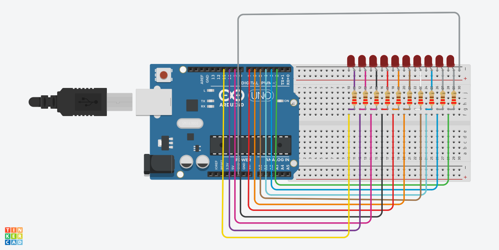

# Nombre del proyecto
Parpadeo de LED con Arduino (Blink)

## Descripción
el objetivo de este codigo expone como prender y apagar un led

## Objetivos de aprendizaje
Programar y simular en Arduino el encendido y apagado intermitente (parpadeo) de un LED conectado al pin digital 13,
utilizando la función delay() para generar un efecto visualmente perceptible.

## Material utilizado
Enumera todos los componentes usados:
- Arduino Uno R4 WiFi
- Protoboar
- Led
- Cables Dupont
- Resistencia 220 ohms
 

## Diagrama del circuito

## Codigo
[Readne.txt](Codigo/Readme.txt)

## Video del funcionamiento

[readme.txt](video/readme.txt)

[Ver video en YouTube]([https://youtube.com/shorts/3cdXH-S2x70?si=RZrwnCCxavKmdopl])

[Ver video en YouTube]([https://youtube.com/shorts/3cdXH-S2x70])

## Evidencias de armado

## Reporte
Incluye:
[reporte.pdf](reporte/reporte.pdf)

## Conclusiones
el código actuo para prender los leds a como se indicaba, tambien conocimos la importancia de las resistencias y conocer un poquito acerca del arduino
## Resultados
[resultados.pdf](resultados/resultados.pdf)

