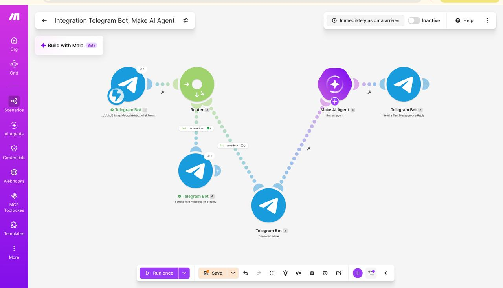

# Nombre del proyecto
AUTOMATIZACION EN MAKE

## Descripción
el objetivo de este codigo expone como prender y apagar un led

## Objetivos de aprendizaje
Desarrollar y desplegar un bot inteligente en la plataforma Telegram capaz de recibir fotografías de plantas enviadas por los usuarios, procesarlas mediante un agente de Inteligencia Artificial en la plataforma Make.com, y emitir un diagnóstico integral con recomendaciones amigables sobre su cuidado, frecuencia de riego y estado de salud general.

## Material utilizado
Enumera todos los componentes usados:
- make
- fotos de plantas
 

## evidencias

## Codigo
[main.txt](codigo/main.txt)

## Video del funcionamiento

[readme](video/readme.txt)

[Ver video en YouTube](https://www.youtube.com/shorts/9MBOCWdkeA0)

## resultados
Incluye:
[ReportedeResultados.pdf](resultados/ReportedeResultados.pdf)

